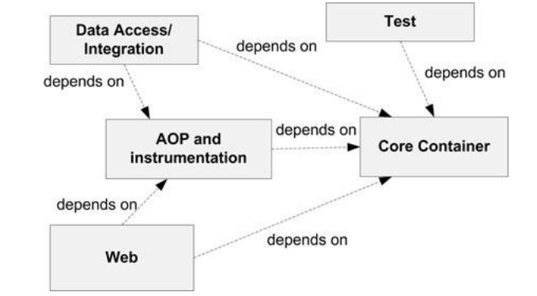

# Chapter 1 Introduction to Spring Framework


## 1-1 Introduction
In the traditional Java enterprise application development efforts, it was a developer's responsibility to create well-structured, maintainable and easy testable applications. The developers used myriad design patterns to address these non-business requirements of an application. This not only led to low developer productivity, but also adversely affected the quality of developed applications.

Spring Framework (or "Spring" in short) is an open source application framework from SpringSource (http://www.springsource.org) that simplifies developing Java enterprise applications. It provides the infrastructure for developing well-strutured, maintainable and easily tesable application. When using Spring Framework, a developer only needs to focus on writing the business logic of the application, resulting in improved developer productivity. You can use Spring Framework to develop standalone Java applications, web applications, applets, or any other type of Java application.

This chapter starts off with an introduction to Spring Framework modules and its benefits. At the heart of Spring Framework is its Inversion o Control (IoC) container, which provides dependency injection (DI) feature. This chapter introduces Spring's DI feature and IoC container, and shows how to develop a standalone Java application using Spring. Towards the end of this chapter, we'll look at some of the SpringSource's projects that use Spring Framework as their foundation. This chapter will set the stage for the remaining chapters that delve deeper into the Spring Framework.

**NOTE** In this book, we'll use an example Internet Banking application, _MyBank_, to introduce Spring Framework features.


## 1-2 Spring Framework modules
Spring Framework consists of multiple modules that are grouped based on the application development features they address. The following table describes the different module groups in Spring Framework:

Module group|Description
--- | ---
Core container | Contains modules that form the foundation of Spring Framework. The modules in this group provide Spring's DI feature and IoC container implementation.
AOP and instrumentation | Contains modules that support AOP and class instrumentation.
DataAccess/Integration | Contains modules that simplify interaction with databases and messaging providers. This module group also contains modules that support programmtic and declarative transaction management, and object/XML mapping implementations, like JAXB and Castor.
Web | contains modules that simplify developing web and portlet applications.
Test | contains a single module that simplifies creating unit and integration tests.

The above table shows that Spring covers every aspect of enterprise application development; you can use Sprng for developing web applications, accessing databases, managing transactions, creating unit and integration tests, and so on. The Spring Framework modules are designed in sucha a way that you _only_ need to include the modules that your application needs. For instance, to use Spring's DI feature in your application, you only need to include the moduels grouped under _Core Container_. As you progress through this book, you'll find details of some of the modules that are part of Spring, and examples that show how they are used in developing applications.
Thw following figure shows the inter-dependencies of different modules of Spring:



Figure 1-1 Spring modules inter-dependencies

You can infer from the above figure that the moduels contained in the _Core container_ group are central to the Spring Framework, and other moduels depend on it. Equally important are the moduels conatined in the _AOP and instrumentation_ group because they porvide AOP features to other modules in the Spring Framework.

Now, that you have some basic idea  about the areas of application development covered by Spring, let's look at the Spring IoC container.


## 1-3 Spring IoC container
A Java application consists of objects that interact with each other to provide applicaton behavior. The objects with which an object interacts are referred to as its _dependencies_. For instance, if an object X interacts with object Y and Z, then Y and Z are dependencies of object X. DI is a design pattern in which the dependencies of an object are typically specified as arguments to its constructor and setter methods. And, these dependencies are injected into the object when it's created.

In a Spring application, Spring IoC container (also referred to as Spring container) is responsebile for creating application objects and injecting their dependencies. The application objects that the Spring container creates and managers are refered as _beans_. As the Spring container is responsible for putting togather application objects, you don't need to implement design patterns, like Factory, Service Locator, and so on, to compose your application. DI is also referred to as Inversion of Control (IoC) because the responsibility of creating and injecting dependencies is _not_ with the application object but the Spring container.

Let's say that the MyBank application (which is the name of our sample application) contains two objects, FixedDepositController and FixedDepositService. The following example listing shows that the FixedDepositController object depends on FiexDepositService object:

**Example listing 1-1** FixedDepositController class
```java
public class FixedDepositController {
	private FixedDepositService fixedDepositService;

	public FixedDepositController(){
		fixedDepositServcie = new FixedDepositServer();
		}
	public boolean submit(){
		//-- save the fixed deposit details
		fixedDepositService.sav(....);
	}
}
```
In the above exmaple listing shows that the FixedDepositService instance is now passed as a constructor argument to the FixedDepositController instance. Now, the FixedDepositService can be configured as a Spring bean. Notice that the FixedDepositController class doesn't implement or extend from any Spring interface or class.

For a given application, information about application objects and their dependencies is specified using _configuration metadata_. Spring IoC container reads application's configuration metadata to instantiate application objects and inject their dependencies. The following example listing shows the configuration metadat(in XML format) for an application that consists of MyController and MyService classes:

**Example listing 1-3:** Configuration metadata
```xml
<beans .....>
	<bean id="myController" class="sample.spring.controller.MyController">
		<constructor-arg index="0" ref="myService"/>
	</bean>
	<bean id="myService" class="sample.spring.service.MyService"/>
</beans>
```

In the above example listing, each <bean> element defines an application object that is managed by the Spring container, and the <contructor-arg> element specifies that an instance of MyService is passed as an argument to MyController's constructor. The <bean> element is discussed in detail later in this chapter, and the <contructor-arg> element is discussed in chapter 2.

Spring container reads the configuration metadat (like the one shown in example listing 1-3) of an application and creats the application objects defined by <bean> elements and injects their dependencies.Spring container makes use of _Java Reflection API_ (http://docs.oracle.com/javase/tutorial/reflect/index.html) to create applicaiton objects and inject their dependencies.The following figure summarizes how Spring container works:

**Figure 1-2** Spring container reads application's configuration metadata and creates a fully configured application.

The configuration metadat can be supplied to Spring container via XML (as shown in example listing 1-3), Java annotations(refer chapter 6) and alseo through the Java code(refer chapter6).

As the Spring container is responsible for creating and managing application objects, enterprise services(like trasaction managerment, security,remote access, and so on) can be transparently applied to the objects by the Spring container. The ability of the Spring container to enhanc the application objects with additional functionality makes it possible for you to model your application objects as simple Java objects (also referred to as _POJO_s or _Plan Old Java Objects_). Java classes corresponding to POJOs are referred to as _POJO classes_, which are nothing but Java classes that don't implement or extend framework-specific interfaces or classes. The enterprise services, like trans


